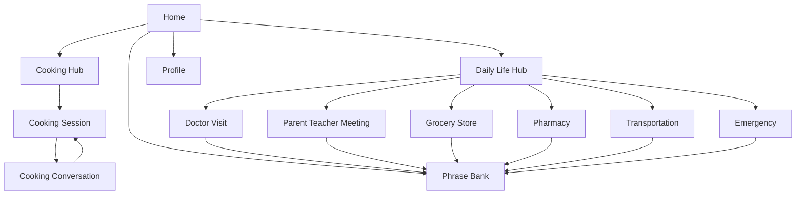
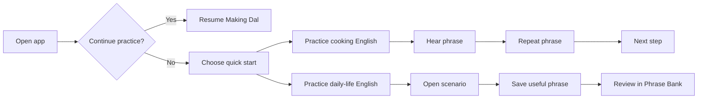

# EasyPeasy Frontend Prototype

Frontend-only React prototype for EasyPeasy, a warm English practice app for South Asian immigrant homemakers.

## Information Architecture

- Home: greeting, continue practice, quick start, today's phrase, recent activity, shortcuts.
- Cooking: recipe hub with food imagery and progress.
- Cooking Session: guided recipe step with instruction, phrase, and practice controls.
- Cooking Conversation: natural correction and speaking practice.
- Daily Life: scenario hub for doctor, school, grocery, pharmacy, transportation, and emergency practice.
- Scenario Screens: phrase-led conversation practice for each everyday situation.
- Phrase Bank: saved phrases grouped by category.
- Profile: language, speech speed, AI voice, saved phrases, help, and about.

## Navigation Flow



## User Flow



## Run

```bash
npm install
npm run dev
```
